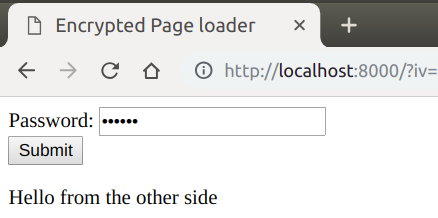

# Encrypted Page

This is a quick proof-of-concept I decided to write to proof that it is possible to do encryption on pure client-side JavaScript. As long as the browser supports `CryptoSubtle`, `TextEncoder` and `TextDecoder`, this should work well.

It should be useful in encrypting `HTML` pages on free static web hosting sites, like `Github Pages`.

# Important notes

If you're not going to read the "How to use" section below, at least read this section, because it contains important information.

1. Firstly, please do not use this for any real security purposes. I've created this prototype as a test to validate the viability of encryption on the client-side.
2. Secondly, the encrypted file generated by the `Go` script is always `encrypted.html`, and the original file is **not** deleted. Please exercise caution when using the Go script.
3. Thirdly, the Initialization Vector (IV) is used for all salts required by the generation of the AES key from the password, and the actual encryption process of the file. The IV is, however, randomly generated per file (or per key in this particular application), so do exercise your judgement on the security of this project.
4. Fourthly, you **need** a web server for this. If not hosted locally, it needs to be served through `https`, otherwise, `http://localhost` will be okay. Using `file:///` is not acceptable due to the CORS Policy on modern browsers. Quick web servers suitable include Python's built-in web server (invoked with `python -m http.server`), Nodejs, and PHP.
5. Lastly, if you were to modify this project to make the encryption more secure, or eliminate other security problems that this project contains, please make a pull request. It helps the others who may be using this project!

# How to use
1. Start a web server in the repository directory. I use Python, so I can invoke Python's `SimpleHTTPServer`:
    ```bash
    python3 -m http.server
    ```
2. Navigate to the page served by your web server. In my case, I visit [http://localhost:8000](http://localhost:8000). **NOTE**: http://0.0.0.0:8000 will disable the Crypto API that this project relies on. Either serve the web page via the `https` protocol, or use `localhost` instead of `0.0.0.0`.
3. Create a file, and populate the file. If you are writing HTML, please only write the content that will go into the `<body>` tag, because that is where your content will be populated in.
    ```html
    <p>Hello from the other side</p>
    ```
4. Run the Go script. You may need to first get the `crypto` package, as the `encrypter.go` script relies on the `pbkdf2` package. Get it by running `go get -u golang.org/x/crypto/...`.
    ```bash
    $ go run encrypter.go
      Password: [key in your password here]
      File to Encrypt: [your file to encrypt here]
      IV: rAnd0mSt1ng12345
      Encrypted file: encrypted.html
     ```
5. Append a `?iv=<iv here>` at the back of your page URL. In my case, the URL to visit is: [http://localhost:8000/?iv=rAnd0mSt1ng12345](http://localhost:8000/?iv=rAnd0mSt1ng12345)
6. Type in the password you used while encrypting, then press submit.
7. The contents you wrote in the eariler HTML file should appear below the `Submit` button.


# License
Check LICENSE.md.
